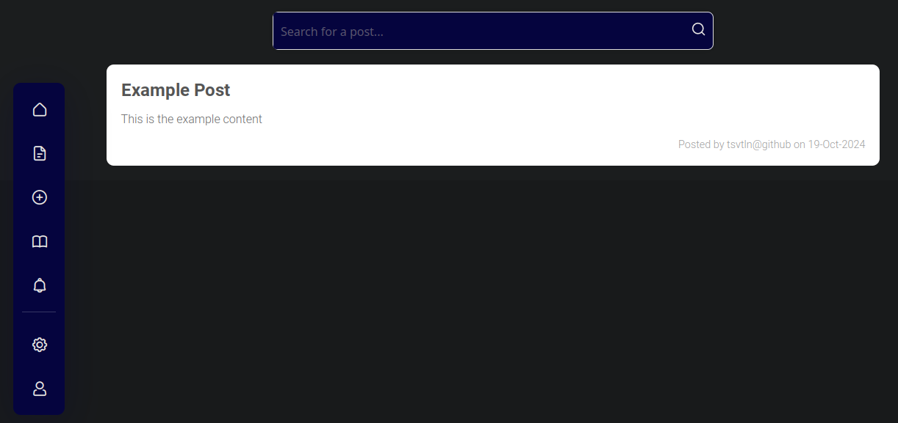

# Barebone Forum App

### A simple forum application with basic functionalities that can be further developed or customized.

#### Current Functionalities

    Posting content
    Deleting posts
    Searching for posts
    Editing posts
    User registration
    Dashboard view
    Notifications
    Settings panel
    Profile page

### Getting Started
#### Prerequisites

    Python 3.x
    Django 3.x or above
    Virtualenv (optional but recommended)

#### Installation

    Clone the repository: git clone https://github.com/tsvtln/forumApp.git

    Navigate into the project directory: cd forumApp

    Create a virtual environment (optional): python -m venv .venv

    Activate it:
        On macOS/Linux: source .venv/bin/activate
        On Windows: .venv\Scripts\activate

    Install the required dependencies: pip install -r requirements.txt

    Run the migrations: python manage.py migrate

    Start the development server: python manage.py runserver

#### Usage

    Register an account and start posting content.
    Use the dashboard to manage posts and notifications.

#### Future Improvements

    Adding more robust user authentication.
    Implementing comment sections for posts.

